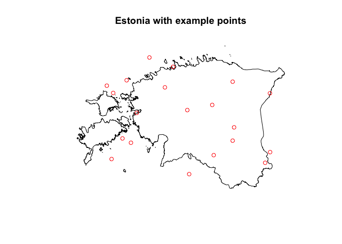
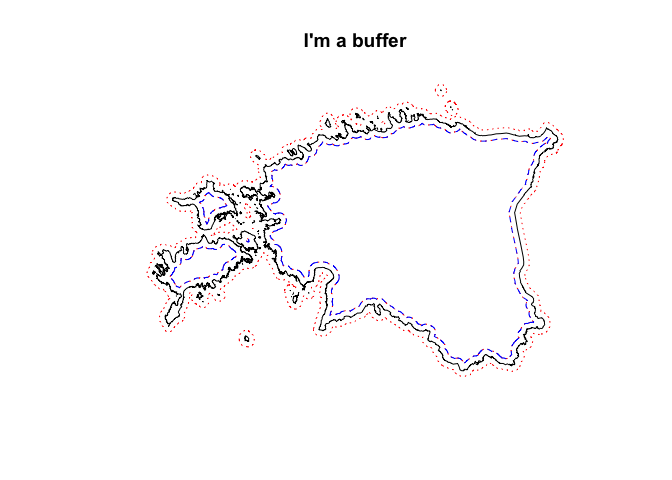

Snap points to lines/polygons
================

-   [To source](#to-source)
-   [Notes](#notes)
    -   [Snap all point to a line](#snap-all-point-to-a-line)
    -   [Snap only those points outside the polygon](#snap-only-those-points-outside-the-polygon)

To source
---------

``` r
devtools::source_url("https://raw.githubusercontent.com/andybega/r-misc/master/snap-points-to-lines/snap-points.R")
```

Notes
-----

``` r
library("maptools")
library("raster")
library("sf")
library("dplyr")
library("units")

source("snap-points.R")

set.seed(4313)
```

``` r
eesti_sp <- getData("GADM", country="EST", level = 0)

eesti <- eesti_sp %>%
  st_as_sf() %>%
  st_simplify(dTolerance = 0.001)
```

    ## Warning in st_simplify.sfc(st_geometry(x), preserveTopology, dTolerance):
    ## st_simplify does not correctly simplify longitude/latitude data, dTolerance
    ## needs to be in decimal degrees

``` r
pts <- eesti %>% 
  # hack to turn bbox into polygon we can sample
  st_geometry() %>% st_make_grid() %>% st_union() %>% 
  st_sample(size = 20) 
```

    ## although coordinates are longitude/latitude, it is assumed that they are planar

``` r
plot(eesti[, 1], col = 0, main = "Estonia with example points")
plot(pts, add = T, col = "red")
```



### Snap all point to a line

``` r
target <- eesti %>% st_geometry() %>% st_boundary() %>% 
  # need to convert MULTILINESTRING to LINESTRING otherwise only the first line
  # will be matched against
  st_cast(., "LINESTRING") 

new_pts <- snap_points_to_line(pts, target, epsg = 3301)

coords1 <- st_coordinates(pts)
coords2 <- st_coordinates(new_pts)
epsg <- st_crs(pts)$epsg
connectors <- lapply(1:length(pts), function(i) {
  x <- rbind(coords1[i, ], coords2[i, ])
  x <- st_linestring(x)
})
connectors <- st_sfc(connectors, crs = epsg)

plot(eesti[, 1], col = 0, main = "Snap all points to border/shore")
plot(pts, add = T, col = "red")
plot(new_pts, add = T, col = "blue")
plot(connectors, add = T)
```


### Snap only those points outside the polygon

``` r
new_pts <- snap_points_to_polygon(pts, st_geometry(eesti), epsg = 3301)

coords1 <- st_coordinates(pts)
coords2 <- st_coordinates(new_pts)
epsg <- st_crs(pts)$epsg
connectors <- lapply(1:length(pts), function(i) {
  x <- rbind(coords1[i, ], coords2[i, ])
  x <- st_linestring(x)
})
connectors <- st_sfc(connectors, crs = epsg)

plot(eesti[, 1], col = 0, main = "Move points outside to border/shore")
plot(pts, add = T, col = "red")
plot(new_pts, add = T, col = "blue")
plot(connectors, add = T)
```


It is possible that this would still leave some points outside the polygon if you check with `st_intersects`. I'm not sure why this is but I would guess precision issues and doing this with lat/long data might be involved. An easy way around this problem is to snap points not to the border/shore, but slightly inside the country using a buffer.

``` r
buffer <- set_units(5000, "m")

eesti_proj <- eesti %>% 
  st_transform(3301) %>%
  dplyr::select(OBJECTID) 

eesti_buffer <- eesti_proj %>%
  # geometry is polygon, buffer of that would only be outside, so use boundary
  st_geometry() %>% st_boundary() %>%
  st_buffer(buffer) %>%
  st_boundary()

plot(eesti_proj, col = 0, main = "I'm a buffer")
plot(eesti_buffer, add = T, col = "red", lty = 3)
eesti_buffer %>%
  st_intersection(., st_geometry(eesti_proj)) %>%
  plot(., col = "blue", lty = 2, add = T)
```



``` r
new_pts <- snap_points_to_polygon(pts, st_geometry(eesti), epsg = 3301,
                                  buffer = buffer)

coords1 <- st_coordinates(pts)
coords2 <- st_coordinates(new_pts)
epsg <- st_crs(pts)$epsg
connectors <- lapply(1:length(pts), function(i) {
  x <- rbind(coords1[i, ], coords2[i, ])
  x <- st_linestring(x)
})
connectors <- st_sfc(connectors, crs = epsg)

plot(eesti[, 1], col = 0, main = "Use a buffer to avoid precision issues")
plot(pts, add = T, col = "red")
plot(new_pts, add = T, col = "blue")
plot(connectors, add = T)
```


