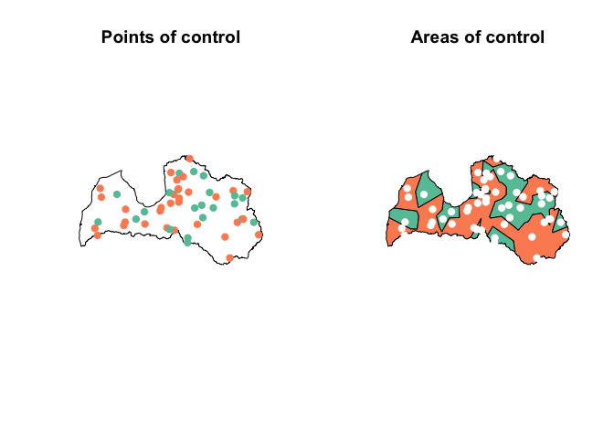
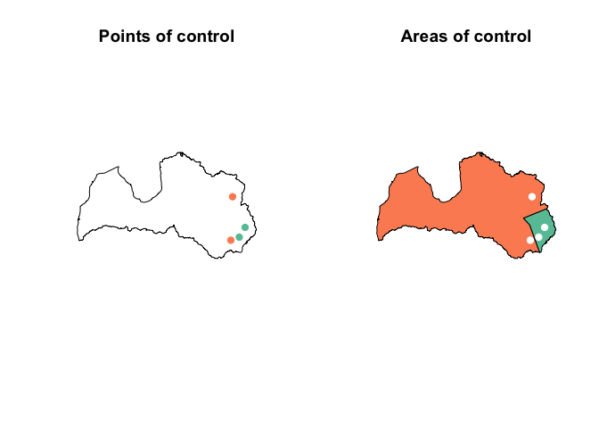
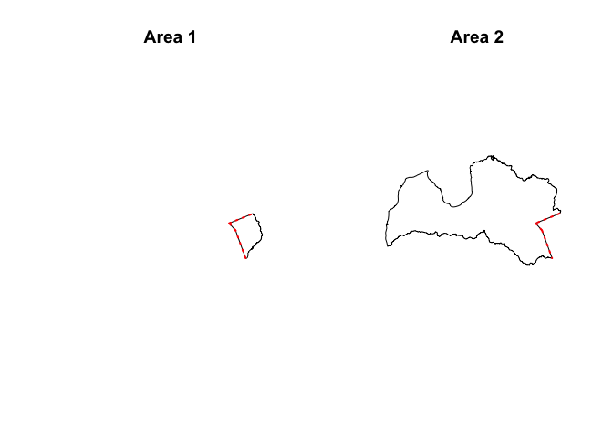
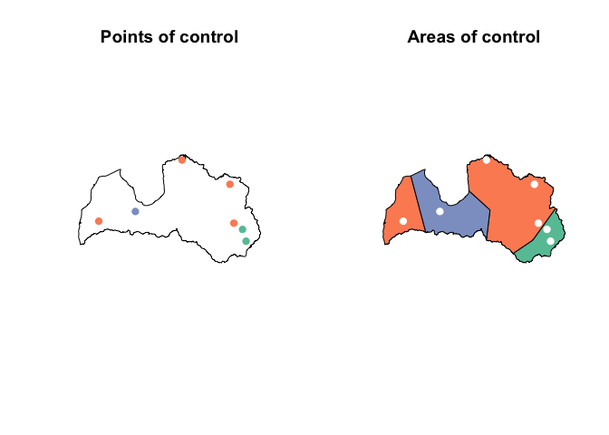
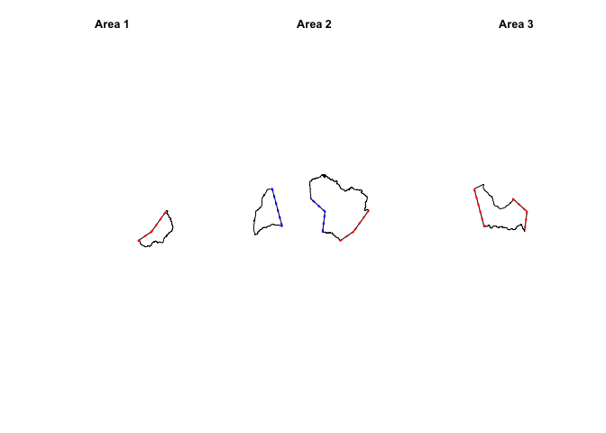
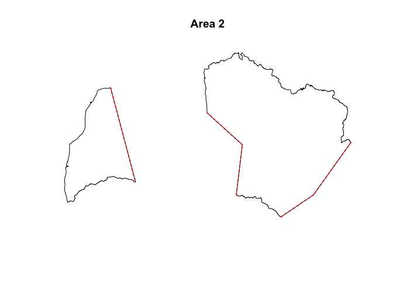
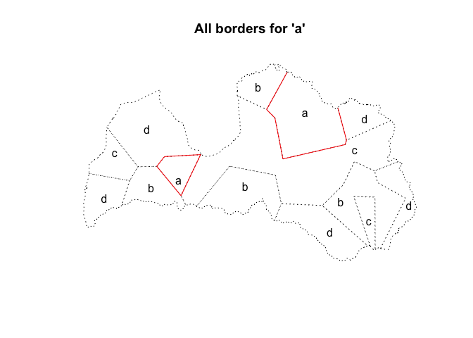

Border lengths and dynamic features
================

-   [Setup the scenario](#setup-the-scenario)
-   [Two groups, one polygon each, monadic](#two-groups-one-polygon-each-monadic)
-   [Multiple groups, multiple polygons (MULTIPOLYGON)](#multiple-groups-multiple-polygons-multipolygon)
-   [Make it more complicated](#make-it-more-complicated)

Setup: a war-like situation. We have data who controls a certain location (point) at a given time. This corresponds to marked spatio-temporal points, or slices of marked points in which the marks can change between slices. Locations that are under dispute can be marked with values for two groups.

What interesting stuff can we derive from that data?

Static features:

-   Estimate areas of control given the points of control data.
-   Extend of frontline for a group.
-   Extent of frontline between two groups (dyadic).
-   Can we measure how "patchy" an area of control is, i.e. is it a contiguous area or split into pieces?
-   Areas under split control, indicating active fighting.
-   How many people are in the area I am controlling?

Dynamic features:

-   Change in area controlled.
-   Change in exposed (monadic) frontline. How much frontline do I have?
-   Change in area controlled for a specific opponent (dyadic).
-   Change in (dyadic) frontline. How much

Setup the scenario
------------------

``` r
library("maptools")
library("raster")
library("sf")
library("dplyr")
library("units")

source("marked-points-to-polygons.R")
source("snap-points.R")
```

We need a larger polygon (country) within which we'll sample marked points.

``` r
country_sp <- getData("GADM", country="LVA", level = 0)

country <- country_sp %>%
  st_as_sf() %>%
  st_transform(3059) %>%
  st_simplify(dTolerance = 200) 

set.seed(1235)
pts <- country %>% 
  st_sample(size = 50) 
pts <- st_sf(mark = sample(letters[1:2], length(pts), replace = TRUE), 
             geometry = pts)

table(pts$mark)
```

    ## 
    ##  a  b 
    ## 22 31

``` r
areas <- marked_points2polygons(pts, "mark", st_geometry(country))
# assumbe attributes are spatially constant to avoid warning when aggregating
areas <- areas %>% st_set_agr("constant")  

par(mfrow = c(1, 2))

plot(country[, 1], col = 0, main = "Points of control")
plot(pts, add = T, pch = 19)

plot(areas[, "mark"], main = "Areas of control")
plot(pts, add = T, pch = 19, col = 0)
```



The spatial stuff will work differently for whether we have POLYGONs or MULTIPOLYGONs, etc. so make this a function that we can use to create different scenarios.

``` r
scenario <- function(country, n_pts, n_groups, seed) {
  set.seed(seed)
  pts <- country %>% 
    st_sample(size = n_pts) 

  pts <- st_sf(mark = sample(letters[1:n_groups], length(pts), replace = TRUE), 
             geometry = pts)

  areas <- marked_points2polygons(pts, "mark", st_geometry(country)) %>%
    st_set_agr("constant")
  list(country = country,
       pts = pts, 
       areas = areas)
}

scen1 <- scenario(country, 3, 2, 1232)

par(mfrow = c(1, 2))

plot(scen1$country[, 1], col = 0, main = "Points of control")
plot(scen1$pts, add = T, pch = 19)

plot(scen1$areas[, "mark"], main = "Areas of control")
plot(scen1$pts, add = T, pch = 19, col = 0)
```



As `?st_sample` explains, for polygon sampling the sample size may be off because the bounding box is sampled and intersecting points are returned. But this works, we have two POLYGONs.

For computing boundaries, this [SO question](https://stackoverflow.com/questions/45338384/calculate-the-length-of-shared-boundaries-between-multiple-polygons) is helpful.

The general algorithm is like this, speaking in spatial data terms:

1.  For each polygon, get a list of which other polygons it touches.
2.  For each polygon, and polygon it touches:
    1.  Use `st_intersection` to get the frontline.
    2.  Use `st_length` to get the length of the frontline

The frontlines are the key, so focus on getting out an object that has those. We also need to know what group the frontline is for (monadic), and eventually what pair of groups it is for (dyadic). Another issue is how to handle this when the geometries are MULTIPOLYGON, not POLYGON.

-   Monadic can be deduced from dyadic, so an implementation that handles dyadic can trivially handle monadic.
-   MULTIPOLYGONs can be split into POLYGONSs, so an implementation that handles multiple POLYGONs can also handle MULTIPOLYGONs with trivial extension.

Table of use cases:

Groups | Polygons |

Two groups, one polygon each, monadic
-------------------------------------

``` r
polygons <- scen1$areas[, "mark"]
touching_list <- polygons %>% st_touches()

borders <- lapply(1:length(touching_list), function(from) {
  lines <- st_intersection(polygons[from, ], polygons[touching_list[[from]], ])
})
borders <- do.call(rbind, borders)

par(mfrow = c(1, 2))
box <- st_bbox(polygons)
for (i in 1:2) {
  plot(polygons[i, 1], main = sprintf("Area %s", i), col = 0,
       xlim = box[c(1, 3)], ylim = box[c(2, 4)])
  plot(borders[i, 1], add = T, col = "red", lty = 3, lwd = 2)
}
```



Multiple groups, multiple polygons (MULTIPOLYGON)
-------------------------------------------------

``` r
scen2 <- scenario(country, 8, 3, 1236)

par(mfrow = c(1, 2))

plot(scen2$country[, 1], col = 0, main = "Points of control")
plot(scen2$pts, add = T, pch = 19)

plot(scen2$areas[, "mark"], main = "Areas of control")
plot(scen2$pts, add = T, pch = 19, col = 0)
```



Each group has one MULTIPOLYGON.

``` r
scen2$areas
```

    ## Simple feature collection with 3 features and 2 fields
    ## Attribute-geometry relationship: 2 constant, 0 aggregate, 0 identity
    ## geometry type:  MULTIPOLYGON
    ## dimension:      XY
    ## bbox:           xmin: 312887.1 ymin: 171809.5 xmax: 762392.8 ymax: 438865.6
    ## epsg (SRID):    3059
    ## proj4string:    +proj=tmerc +lat_0=0 +lon_0=24 +k=0.9996 +x_0=500000 +y_0=-6000000 +ellps=GRS80 +towgs84=0,0,0,0,0,0,0 +units=m +no_defs
    ##   mark points                       geometry
    ## 1    a      2 MULTIPOLYGON (((633803.0537...
    ## 2    b      4 MULTIPOLYGON (((682445.7484...
    ## 3    c      1 MULTIPOLYGON (((418384.2168...

Apply the code from before again. The plotting code is a bit different since for Area 2 we will now get two borders.

``` r
polygons <- scen2$areas[, "mark"]
touching_list <- polygons %>% st_touches()

borders <- lapply(1:length(touching_list), function(from) {
  lines <- st_intersection(polygons[from, ], polygons[touching_list[[from]], ])
})
borders <- do.call(rbind, borders)

par(mfrow = c(1, nrow(polygons)))
box <- st_bbox(polygons)
for (i in 1:nrow(polygons)) {
  mark <- unique(polygons[i, ][["mark"]])
  plot(polygons[i, 1], main = sprintf("Area %s", i), col = 0,
       xlim = box[c(1, 3)], ylim = box[c(2, 4)])
  plot(borders[borders$mark==mark, 1], add = T, col = c("red", "blue"), lty = 3, lwd = 2)
}
```



This is already dyadic, but note that the border between Area 2 and Area 3, where Area 2 brackets Area 3, is one geometry (the blue lines). If we split the MULTIPOLYGON inputs into POLYGONs, that would be different (see below).

``` r
polygons
```

    ## Simple feature collection with 3 features and 1 field
    ## Attribute-geometry relationship: 1 constant, 0 aggregate, 0 identity
    ## geometry type:  MULTIPOLYGON
    ## dimension:      XY
    ## bbox:           xmin: 312887.1 ymin: 171809.5 xmax: 762392.8 ymax: 438865.6
    ## epsg (SRID):    3059
    ## proj4string:    +proj=tmerc +lat_0=0 +lon_0=24 +k=0.9996 +x_0=500000 +y_0=-6000000 +ellps=GRS80 +towgs84=0,0,0,0,0,0,0 +units=m +no_defs
    ##   mark                       geometry
    ## 1    a MULTIPOLYGON (((633803.0537...
    ## 2    b MULTIPOLYGON (((682445.7484...
    ## 3    c MULTIPOLYGON (((418384.2168...

``` r
borders
```

    ## Simple feature collection with 4 features and 2 fields
    ## geometry type:  MULTILINESTRING
    ## dimension:      XY
    ## bbox:           xmin: 381261.2 ymin: 195015.2 xmax: 737965.4 ymax: 386678
    ## epsg (SRID):    3059
    ## proj4string:    +proj=tmerc +lat_0=0 +lon_0=24 +k=0.9996 +x_0=500000 +y_0=-6000000 +ellps=GRS80 +towgs84=0,0,0,0,0,0,0 +units=m +no_defs
    ##     mark mark.1                       geometry
    ## 1      a      b MULTILINESTRING ((633803.05...
    ## 2      b      a MULTILINESTRING ((682445.74...
    ## 2.1    b      c MULTILINESTRING ((567934.14...
    ## 3      c      b MULTILINESTRING ((418384.21...

``` r
borders %>% st_length() %>% set_units("km")
```

    ## Units: km
    ## [1] 154.1901 154.1901 289.3683 289.3683

To make it monadic, we can group by the mark. Each polygon now corresponds to one border row containing it's borders with other polygons.

``` r
borders_monadic <- borders %>%
  group_by(mark) %>%
  summarize()

polygons
```

    ## Simple feature collection with 3 features and 1 field
    ## Attribute-geometry relationship: 1 constant, 0 aggregate, 0 identity
    ## geometry type:  MULTIPOLYGON
    ## dimension:      XY
    ## bbox:           xmin: 312887.1 ymin: 171809.5 xmax: 762392.8 ymax: 438865.6
    ## epsg (SRID):    3059
    ## proj4string:    +proj=tmerc +lat_0=0 +lon_0=24 +k=0.9996 +x_0=500000 +y_0=-6000000 +ellps=GRS80 +towgs84=0,0,0,0,0,0,0 +units=m +no_defs
    ##   mark                       geometry
    ## 1    a MULTIPOLYGON (((633803.0537...
    ## 2    b MULTIPOLYGON (((682445.7484...
    ## 3    c MULTIPOLYGON (((418384.2168...

``` r
borders_monadic
```

    ## Simple feature collection with 3 features and 1 field
    ## geometry type:  MULTILINESTRING
    ## dimension:      XY
    ## bbox:           xmin: 381261.2 ymin: 195015.2 xmax: 737965.4 ymax: 386678
    ## epsg (SRID):    3059
    ## proj4string:    +proj=tmerc +lat_0=0 +lon_0=24 +k=0.9996 +x_0=500000 +y_0=-6000000 +ellps=GRS80 +towgs84=0,0,0,0,0,0,0 +units=m +no_defs
    ## # A tibble: 3 x 2
    ##     mark          geometry
    ##   <fctr>  <simple_feature>
    ## 1      a <MULTILINESTR...>
    ## 2      b <MULTILINESTR...>
    ## 3      c <MULTILINESTR...>

``` r
plot(polygons[2, 1], main = sprintf("Area %s", 2), col = 0)
plot(borders_monadic[2, 1], add = T, col = "red", lty = 3, lwd = 2)
```



``` r
borders_monadic %>% st_length() %>% set_units("km")
```

    ## Units: km
    ## [1] 154.1901 443.5584 289.3683

Pack it into a function.

``` r
borders <- function(polygons, x, monadic = TRUE) {
  stopifnot(inherits(polygons, "sf"))
  stopifnot(is.character(x))
  stopifnot(x %in% names(polygons))

  touching_list <- polygons %>% st_touches()
  
  borders <- lapply(1:length(touching_list), function(from) {
    lines <- st_intersection(polygons[from, ], polygons[touching_list[[from]], ])
  })
  borders <- do.call(rbind, borders)
  
  if (monadic) {
    borders <- borders %>%
      group_by_at(vars(x)) %>%
      summarize()
  }
  borders
}

monadic <- borders(scen2$areas, "mark", monadic = TRUE)
monadic
```

    ## Simple feature collection with 3 features and 1 field
    ## geometry type:  MULTILINESTRING
    ## dimension:      XY
    ## bbox:           xmin: 381261.2 ymin: 195015.2 xmax: 737965.4 ymax: 386678
    ## epsg (SRID):    3059
    ## proj4string:    +proj=tmerc +lat_0=0 +lon_0=24 +k=0.9996 +x_0=500000 +y_0=-6000000 +ellps=GRS80 +towgs84=0,0,0,0,0,0,0 +units=m +no_defs
    ## # A tibble: 3 x 2
    ##     mark          geometry
    ##   <fctr>  <simple_feature>
    ## 1      a <MULTILINESTR...>
    ## 2      b <MULTILINESTR...>
    ## 3      c <MULTILINESTR...>

``` r
dyadic  <- borders(scen2$areas, "mark", monadic = FALSE)
dyadic
```

    ## Simple feature collection with 4 features and 4 fields
    ## geometry type:  MULTILINESTRING
    ## dimension:      XY
    ## bbox:           xmin: 381261.2 ymin: 195015.2 xmax: 737965.4 ymax: 386678
    ## epsg (SRID):    3059
    ## proj4string:    +proj=tmerc +lat_0=0 +lon_0=24 +k=0.9996 +x_0=500000 +y_0=-6000000 +ellps=GRS80 +towgs84=0,0,0,0,0,0,0 +units=m +no_defs
    ##     mark points mark.1 points.1                       geometry
    ## 1      a      2      b        4 MULTILINESTRING ((633803.05...
    ## 2      b      4      a        2 MULTILINESTRING ((682445.74...
    ## 2.1    b      4      c        1 MULTILINESTRING ((567934.14...
    ## 3      c      1      b        4 MULTILINESTRING ((418384.21...

Make it more complicated
------------------------

``` r
scen3 <- scenario(country, 20, 4, 1236)

par(mfrow = c(1, 2))

plot(scen3$country[, 1], col = 0, main = "Points of control")
plot(scen3$pts, add = T, pch = 19)

plot(scen3$areas[, "mark"], main = "Areas of control")
plot(scen3$pts, add = T, pch = 19, col = 0)
```


``` r
monadic <- borders(scen3$areas, "mark", monadic = TRUE)
dyadic <- borders(scen3$areas, "mark", monadic = FALSE)

lbls <- scen3$areas %>%
  st_cast("POLYGON") %>%
  st_point_on_surface() %>%
  cbind(., st_coordinates(.))

plot(scen3$areas[, 1], col = 0, lty = 3, main = "All borders for 'a'")
plot(monadic[1, 1], add = TRUE, col = "red")
with(lbls, text(x = X, y = Y, label = mark))
```



``` r
plot(scen3$areas[, 1], col = 0, lty = 3, main = "All borders for 'a', colored by whom with")
plot(dyadic[dyadic$mark=="a", "mark.1"], add = TRUE, col = c("green", "blue", "red"))
with(lbls, text(x = X, y = Y, label = mark))
```


