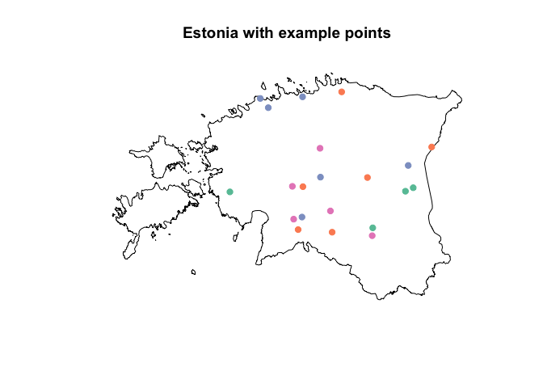
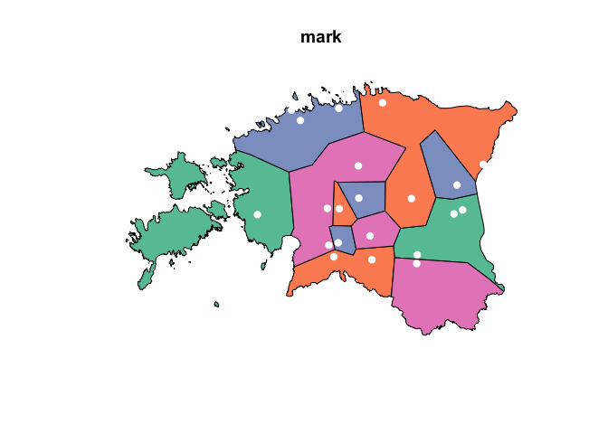

Marked points to polygons
================

Convert points marked with a categorical variable to a polygons for each category.

``` r
devtools::source_url("https://raw.githubusercontent.com/andybega/r-misc/master/spatial/marked-points-to-polygons.R")
```

``` r
library("maptools")
library("raster")
library("sf")
library("dplyr")
library("units")

source("marked-points-to-polygons.R")
```

Generate some example points with marks.

``` r
eesti_sp <- getData("GADM", country="EST", level = 0)

eesti <- eesti_sp %>%
  st_as_sf() %>%
  st_transform(3301) %>%
  st_simplify(dTolerance = 200) 

set.seed(1235)
pts <- eesti %>% 
  st_geometry() %>% 
  st_sample(size = 20) 
pts <- st_sf(mark = sample(letters[1:4], length(pts), replace = TRUE), geometry = pts)

table(pts$mark)
```

    ## 
    ## a b c d 
    ## 4 6 6 5

``` r
plot(eesti[, 1], col = 0, main = "Estonia with example points")
plot(pts, add = T, pch = 19)
```



``` r
areas <- marked_points2polygons(pts, "mark", st_geometry(eesti))

plot(areas[, "mark"])
plot(pts, add = T, pch = 19, col = 0)
```



This doesn't respect boundaries in the original input polygons, like the islands off the mainland. To do that is a bit tricky because what happens when one of the polygons doesn't have any points in it?
